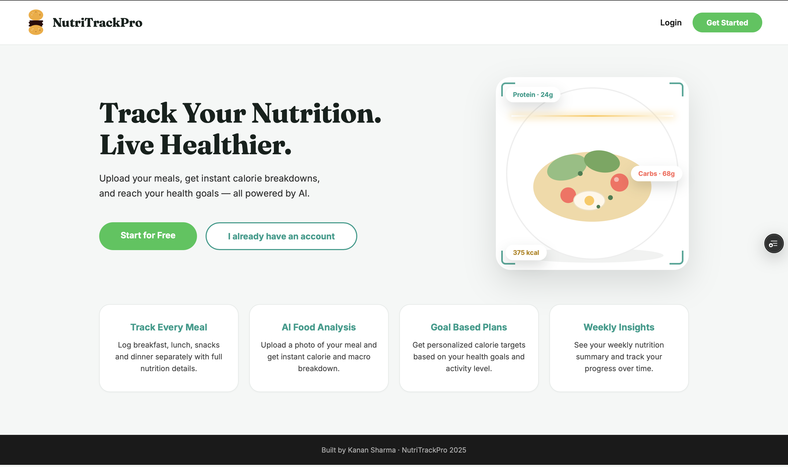
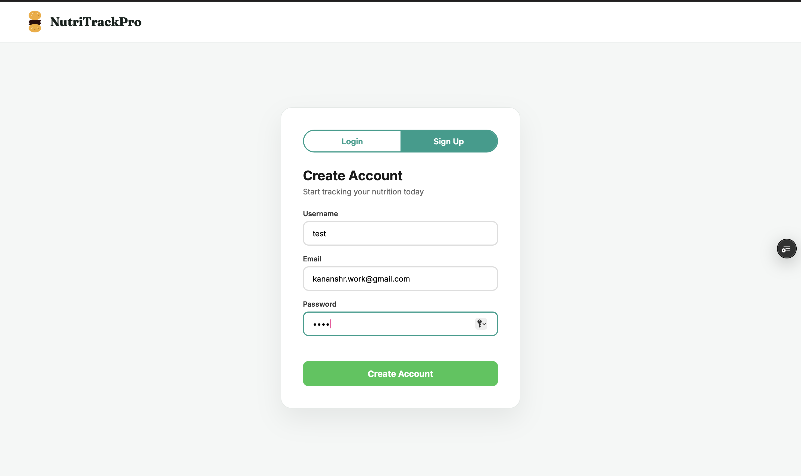
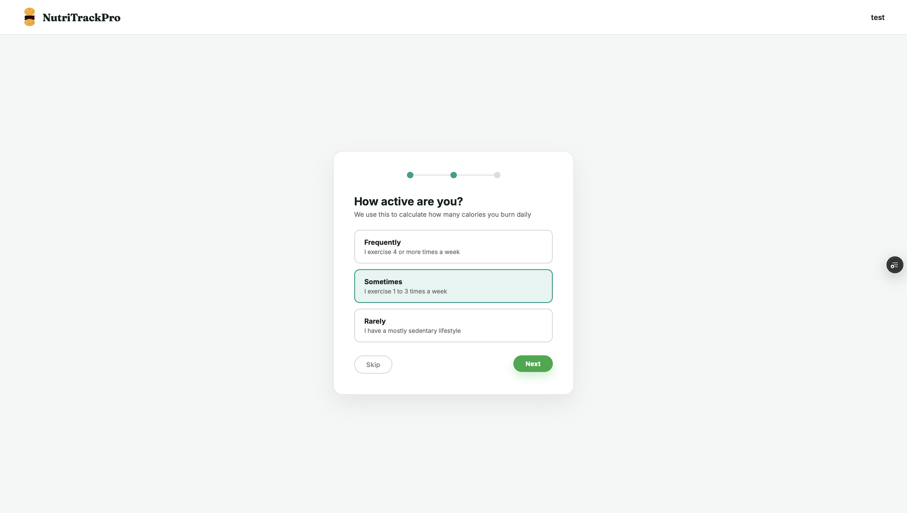
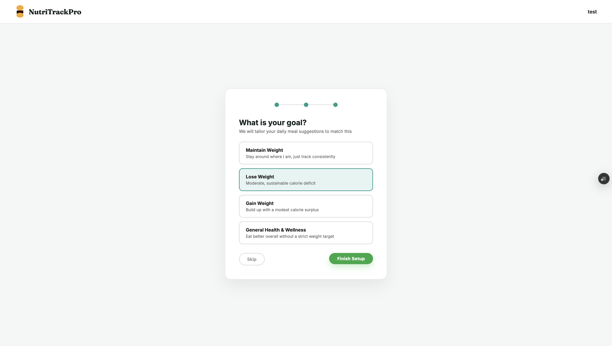
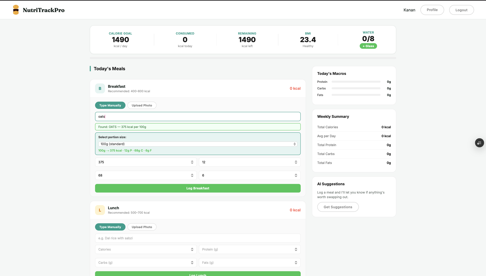
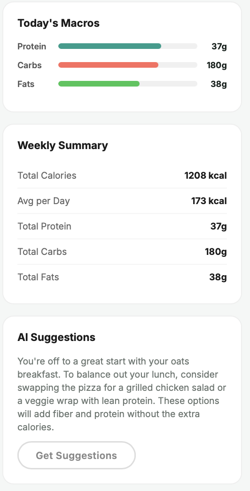

# NutriTrackPro 

A full-stack AI-powered nutrition tracking web application that helps users monitor their daily calorie intake, track macronutrients, and analyse food through image recognition.

**Live Demo:** [nutri-track-pro-six.vercel.app](https://nutri-track-pro-six.vercel.app)  
**Backend API:** [nutritrackpro-api.onrender.com](https://nutritrackpro-api.onrender.com)

---

## App Preview

***Main Page***


***Authentication***


***Onboarding***

---

---


***Dashboard***

---

---


***Profile***


---

## Features

- **AI Food Image Classification** — Upload a photo of your meal and get instant food identification using a ViT (Vision Transformer) model trained on 10,000 food images with 99.2% accuracy
- **Smart Nutrition Search** — Auto-fetch nutrition data from USDA FoodData Central API by typing any food name, with flexible portion sizing (grams, common servings, or quantity-based count e.g. "3 pieces")
- **Calorie & Macro Tracking** — Track daily calories, protein, carbs, and fats with animated, real-time progress bars
- **Goal-Based Calorie Targets** — BMR/TDEE calculation (Mifflin-St Jeor formula) based on age, weight, height, and activity level, adjusted for one of four goals: Maintain Weight, Lose Weight, Gain Weight, or General Health & Wellness. Includes input validation and a hard safety floor (1200/1500 kcal) so the target can never drop to an unsafe level regardless of input
- **AI-Powered Meal Suggestions** — Flags meals that run above the typical calorie range for that meal type, and generates short, goal-aware swap suggestions via an LLM (Groq/Llama 3.1), naming the specific meal in question
- **Goal-Reached Notification** — A popup alerts the user once their daily calorie target is met, with a goal-aware congratulatory message (shown once per day)
- **Email-Verified Signup** — Real account verification via email link before login is permitted, using SendGrid's HTTP API (chosen specifically because most free-tier hosts, including Render, block outbound SMTP)
- **Weekly Summary** — View weekly nutrition totals and daily averages
- **BMI Calculator** — Automatic BMI calculation and classification
- **Water Tracker** — Track daily water intake
- **JWT Authentication** — Secure, token-based sessions with bcrypt-hashed passwords
---

## Tech Stack

**Frontend**
- HTML, CSS, JavaScript (Vanilla)
- Fraunces (display serif) + Inter (body/UI) typography
- Scroll-reveal and count-up animations via IntersectionObserver
- Hosted on Vercel

**Backend**
- FastAPI (Python)
- SQLAlchemy ORM
- PostgreSQL
- JWT Authentication (OAuth2), bcrypt password hashing
- Hosted on Render

**AI / ML**
- Vision Transformer (ViT) — food image classification
- Roboflow — model training and inference
- USDA FoodData Central API — nutrition data
- Groq (Llama 3.1) — AI-generated, goal-aware meal suggestions

---

## Architecture

1. **Frontend** (Vercel) — HTML/CSS/JS served statically
2. **Backend** (Render) — FastAPI REST API
3. **Database** — PostgreSQL (user data, meal logs)
4. **Nutrition Data** — USDA FoodData Central API
5. **Food AI** — Roboflow ViT model (food image classification)
---

**Email**
- SendGrid HTTP API — account verification emails (SMTP is blocked on Render's free tier, so email is sent over HTTPS instead)
---

## API Endpoints
 
| Method   | Endpoint            | Description                                                                                                |
|----------|---------------------|------------------------------------------------------------------------------------------------------------|
| POST     | `/signup`           | Register new user, sends a verification email                                                              |
| GET      | `/verify_email`     | Verifies a user's email from the emailed link                                                              |
| POST     | `/login`            | User login, returns JWT (blocked until email is verified)                                                  |
| GET/POST | `/profile`          | Get or update user profile, including goal                                                                 |
| POST     | `/predict`          | Food image classification                                                                                  |
| GET      | `/nutrition_search` | Search nutrition by food name                                                                              |
| POST     | `/log_meal`         | Log a meal entry (flags high-calorie meals by type-specific range)                                         |
| GET      | `/today_meals`      | Get today's meal logs                                                                                      |
| GET      | `/weekly_summary`   | Get 7-day nutrition summary                                                                                |
| GET      | `/suggest`          | AI-generated meal suggestion or goal-reached message, tailored to the user's goal and today's logged meals |
| DELETE   | `/delete_meal/{id}` | Delete a meal entry                                                                                        |
 
---

## Local Setup
 
**Prerequisites:** Python 3.10+, pip
 
```bash
# Clone the repo
git clone https://github.com/kananshr13/NutriTrackPro.git
cd NutriTrackPro
 
# Backend setup
cd backend
pip install -r requirements.txt
 
# Create .env file
cp .env.example .env
# Fill in the variables listed below
 
# Run the backend
uvicorn main:app --reload
 
# Frontend
# Open frontend/index.html in your browser
# Or serve with Live Server in VS Code
```
 
---

## Environment Variables
 
| Variable              | Description                                                                                                            |
|-----------------------|------------------------------------------------------------------------------------------------------------------------|
| `DATABASE_URL`        | PostgreSQL connection string                                                                                           |
| `SECRET_KEY`          | JWT secret key                                                                                                         |
| `USDA_API_KEY`        | USDA FoodData Central API key                                                                                          |
| `ROBOFLOW_API_KEY`    | Roboflow inference API key                                                                                             |
| `GROQ_API_KEY`        | Groq API key, powers AI meal suggestions ([console.groq.com](https://console.groq.com))                                |
| `SENDGRID_API_KEY`    | SendGrid API key, sends verification emails ([app.sendgrid.com](https://app.sendgrid.com))                             |
| `SENDGRID_FROM_EMAIL` | The email address verified via SendGrid's Single Sender Verification                                                   |
| `BACKEND_URL`         | The deployed backend's public URL, used to build the verification link (e.g. `https://nutritrackpro-api.onrender.com`) |
 
> **Note on hosting SMTP:** email verification is intentionally built on SendGrid's HTTP API rather than raw SMTP, since Render (and most free-tier PaaS providers) block outbound SMTP ports 25/465/587 at the network level. An HTTP-based provider avoids this entirely.
 
---

## ML Model

The food classification model is a **Vision Transformer (ViT Base)** fine-tuned on 10,000 food images across multiple categories including pizza, burger, sushi, pasta, salad, fried rice, and more.
 
- **Architecture:** ViT Base (224x224)
- **Training:** Roboflow AutoTrain
- **Dataset:** 7,000 train / 2,000 validation / 1,000 test
- **Accuracy:** 99.2%
---
 
Built by [Kanan Sharma](https://github.com/kananshr13)
