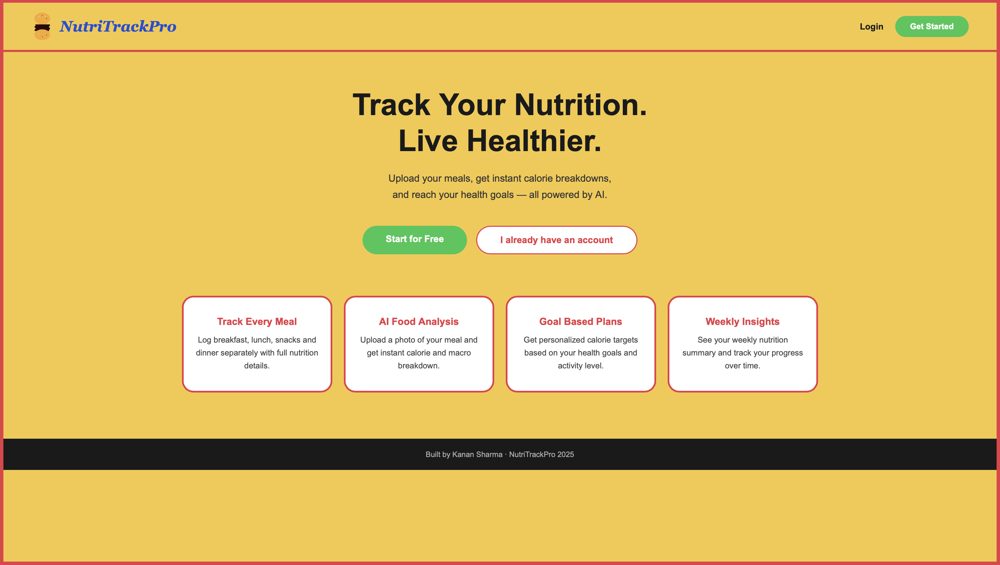
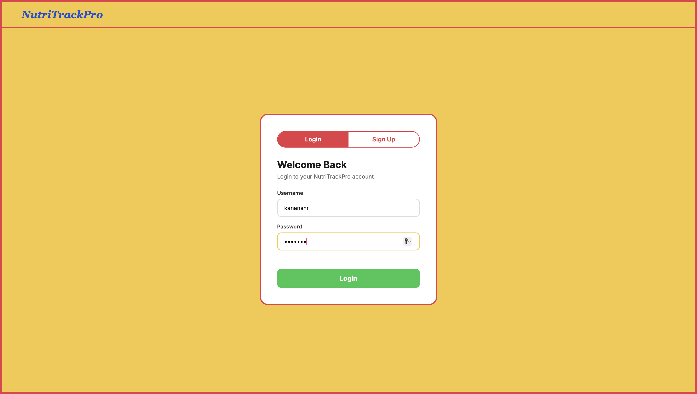
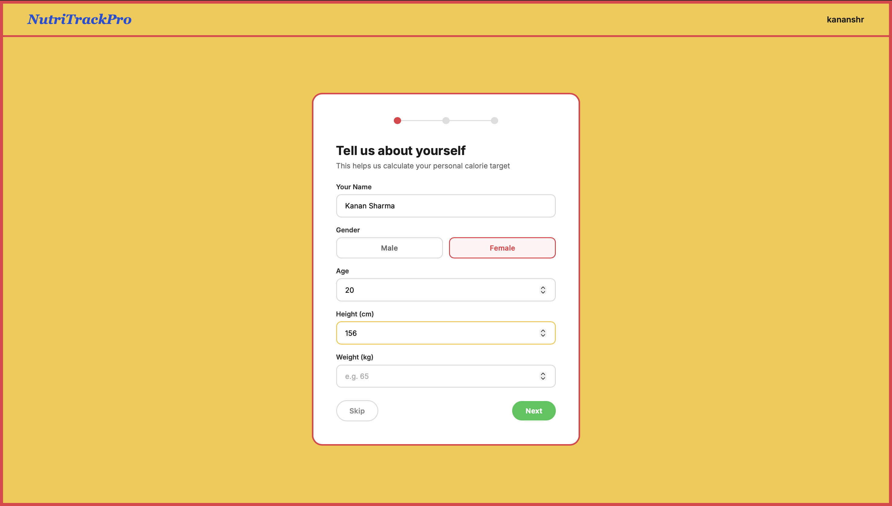
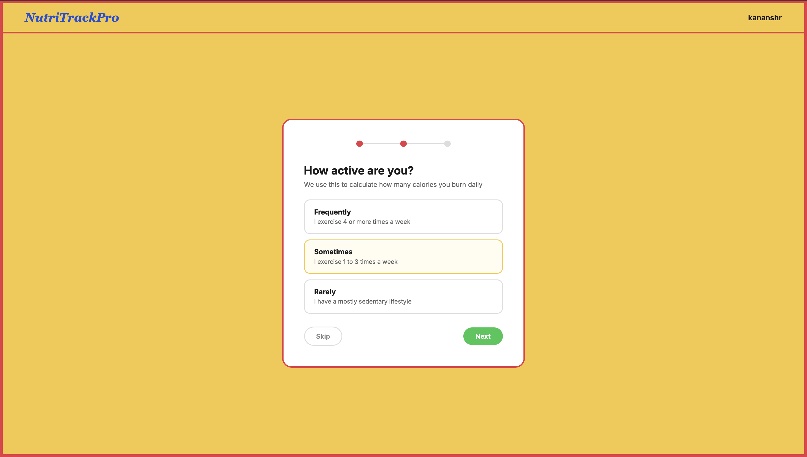
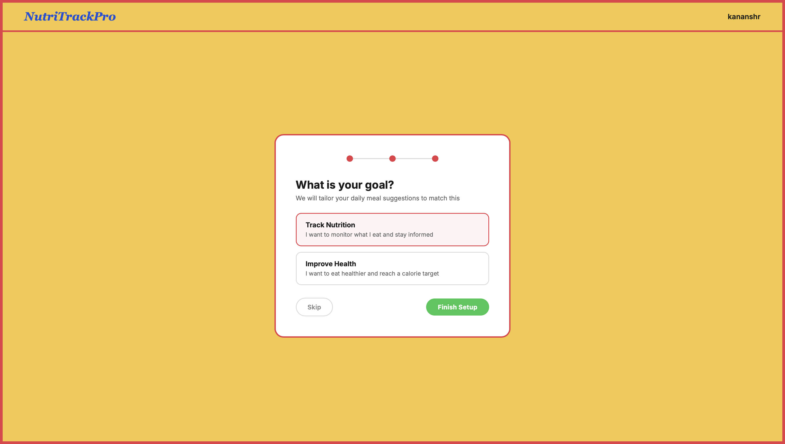
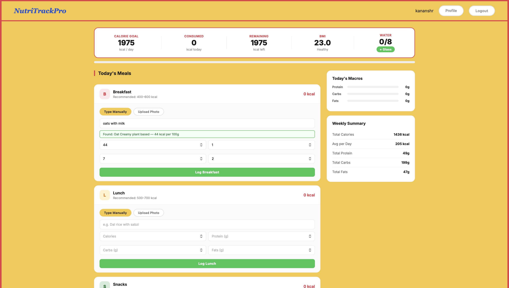
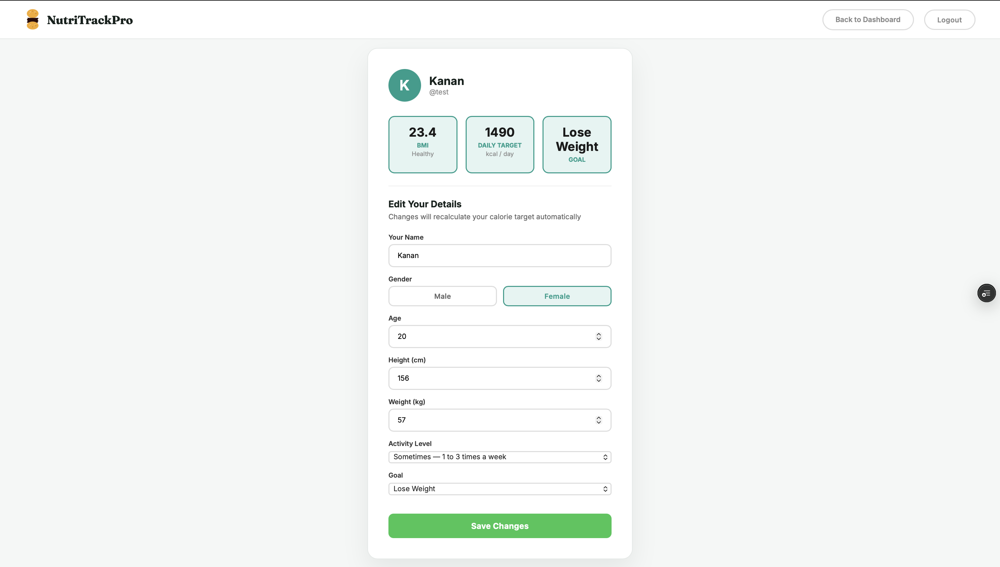

**Work in Progress**
---
The project is under active development and is not ready for the production and  deployement.
---
**App Preview**
--
***main page***

***user login***

***user details***

***activity level***

***user goals***

***dashboard***

***user profile***

---
**Current work done**
---
1. User authentication System
    - user can register/creat a new account(sign in)
    - existing users can login 
    - session is managed

2. User onboarding flow
    - personal information is collected
    - users goals and activity level are selected
    - calorie target calculated (BMI)

3. Dashboard Interface
   - Nutrition overview dashboard
   - Daily calorie tracking
   - Meal tracking interface

4. Profile Management
   - User profile creation
   - Profile data retrieval

5. Meal Logging System
   - Image-based meal uploads
   - Nutrition analysis pipeline
   - Meal history storage

6. Backend Development
   - FastAPI backend implementation
   - SQLite database integration
   - REST API endpoints
   - Hugging Face model training

7. Frontend Development
   - Responsive UI design
   - HTML/CSS/JavaScript implementation
   - Multi-page navigation flow

8. Database Design
   - User model
   - Meal model
   - Nutrition storage

