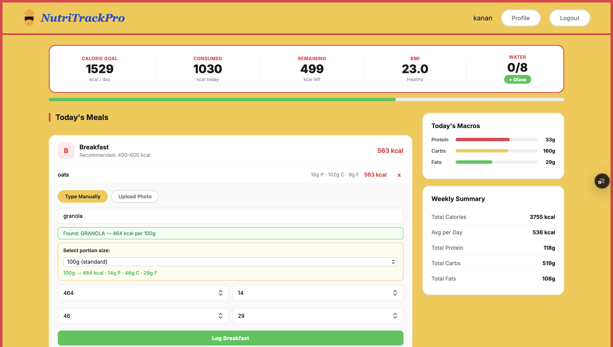
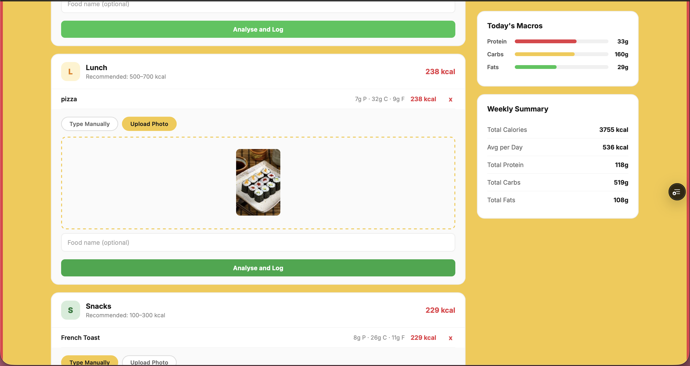

# NutriTrackPro 

A full-stack AI-powered nutrition tracking web application that helps users monitor their daily calorie intake, track macronutrients, and analyse food through image recognition.

**Live Demo:** [nutri-track-pro-six.vercel.app](https://nutri-track-pro-six.vercel.app)  
**Backend API:** [nutritrackpro-api.onrender.com](https://nutritrackpro-api.onrender.com)

---

## App Preview

***Main Page***


***Authentication***


***Onboarding***


***Dashboard***

---


***Profile***


---

## Features

- **AI Food Image Classification** — Upload a photo of your meal and get instant food identification using a ViT (Vision Transformer) model trained on 10,000 food images with 99.2% accuracy
- **Smart Nutrition Search** — Auto-fetch nutrition data from USDA FoodData Central API by typing any food name
- **Calorie & Macro Tracking** — Track daily calories, protein, carbs, and fats with visual progress bars
- **Personalised Calorie Targets** — BMR/TDEE calculation using Mifflin-St Jeor formula based on age, weight, height, activity level, and goal
- **Meal Logging** — Log breakfast, lunch, dinner, and snacks with portion size selector
- **Weekly Summary** — View weekly nutrition totals and daily averages
- **BMI Calculator** — Automatic BMI calculation and classification
- **Water Tracker** — Track daily water intake
- **JWT Authentication** — Secure user authentication with token-based sessions

---

## Tech Stack

**Frontend**
- HTML, CSS, JavaScript (Vanilla)
- Hosted on Vercel

**Backend**
- FastAPI (Python)
- SQLAlchemy ORM
- PostgreSQL
- JWT Authentication (OAuth2)
- Hosted on Render

**AI / ML**
- Vision Transformer (ViT) — food image classification
- Roboflow — model training and inference
- USDA FoodData Central API — nutrition data

---

## Architecture

1. **Frontend** (Vercel) — HTML/CSS/JS served statically
2. **Backend** (Render) — FastAPI REST API
3. **Database** — PostgreSQL (user data, meal logs)
4. **Nutrition Data** — USDA FoodData Central API
5. **Food AI** — Roboflow ViT model (food image classification)
---

## API Endpoints

| Method | Endpoint | Description |
|--------|----------|-------------|
| POST | `/signup` | Register new user |
| POST | `/login` | User login, returns JWT |
| GET/POST | `/profile` | Get or update user profile |
| POST | `/predict` | Food image classification |
| GET | `/nutrition_search` | Search nutrition by food name |
| POST | `/log_meal` | Log a meal entry |
| GET | `/today_meals` | Get today's meal logs |
| GET | `/weekly_summary` | Get 7-day nutrition summary |
| DELETE | `/delete_meal/{id}` | Delete a meal entry |

---

## Local Setup

**Prerequisites:** Python 3.10+, pip

```bash
# Clone the repo
git clone https://github.com/kananshr13/NutriTrackPro.git
cd NutriTrackPro

# Backend setup
cd backend
pip install -r requirements.txt

# Create .env file
cp .env.example .env
# Add your keys: DATABASE_URL, SECRET_KEY, USDA_API_KEY, ROBOFLOW_API_KEY

# Run the backend
uvicorn main:app --reload

# Frontend
# Open frontend/index.html in your browser
# Or serve with Live Server in VS Code
```

---

## Environment Variables

| Variable | Description |
|----------|-------------|
| `DATABASE_URL` | PostgreSQL connection string |
| `SECRET_KEY` | JWT secret key |
| `USDA_API_KEY` | USDA FoodData Central API key |
| `ROBOFLOW_API_KEY` | Roboflow inference API key |

---

## ML Model

The food classification model is a **Vision Transformer (ViT Base)** fine-tuned on 10,000 food images across multiple categories including pizza, burger, sushi, pasta, salad, fried rice, and more.

- **Architecture:** ViT Base (224x224)
- **Training:** Roboflow AutoTrain
- **Dataset:** 7,000 train / 2,000 validation / 1,000 test
- **Accuracy:** 99.2%

---

Built by [Kanan Sharma](https://github.com/kananshr13)
